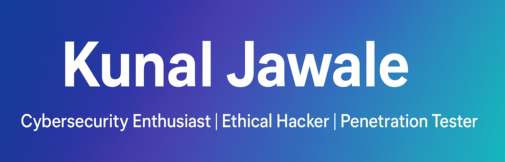

# 👋Hello World, I'm Kunal Jawale 

💻 Breaking barriers to build stronger defenses

🚀 **Cybersecurity Enthusiast | VAPT Analyst | Security Researcher**  

Welcome to my GitHub profile! I’m passionate about **offensive security, penetration testing, and vulnerability assessments**.  
Here I share my projects, writeups, and learning journey in the field of cybersecurity.  

---

## 🛠️ Skills & Tools  
- 🔐 Penetration Testing (Web, Network, Mobile)  
- 🕵️ Vulnerability Assessment & Exploitation  
- 🌐 Kali Linux | Burp Suite | Metasploit | Nmap | Wireshark | Nessus | Splunk | Openvas | Snort
- 💻 Python | Bash | SQL  

---

## 📂 Featured Projects  
- 📘 [CEHv13 Reports](https://github.com/kunal-5055/CEHv13-reports)  
- 🛰️ Scanning & Enumeration Module  
- 🧑‍💻 Malware Analysis & Sniffing  
- 🎯 Vulnerability Assessment & System Hacking  

---

## 📊 GitHub Stats  

  
  

  

---

## 🤝 Contact Me  

  
  
  

---

⭐ **Fun Fact:** *I love breaking systems ethically to make them stronger!*  
